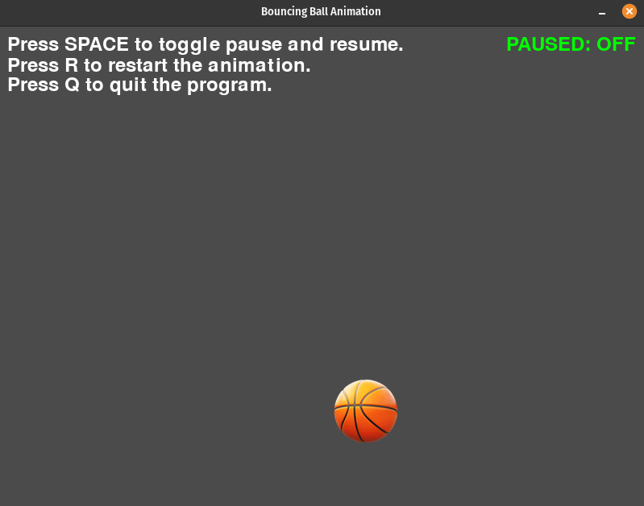
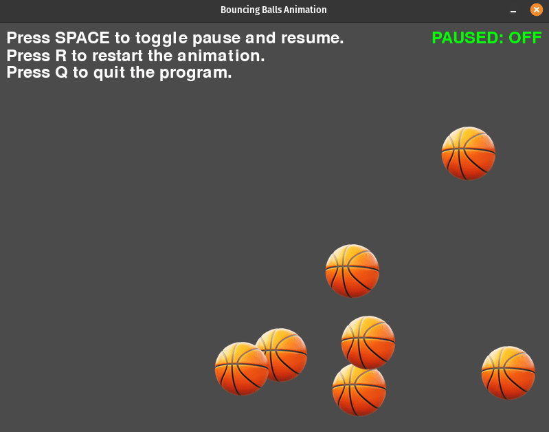

# Bouncing Ball Animation

## Description

The Bouncing Ball Animation is a Python program that utilizes the Pygame library to create a visually engaging animation featuring bouncing balls within a window. The animation offers an interactive and dynamic simulation of multiple balls moving across the screen, complete with user controls to pause, restart, or quit the animation.

### Files

- `ball.py`: Contains the `Ball` class definition, responsible for managing the properties and behavior of the bouncing balls.
- `main_ball.py`: The main program file for a basic bouncing ball animation with user controls.
- `main_n_ball.py`: The main program file for multiple bouncing balls animation with and user controls.

## How It Works

The program utilizes the Pygame library to create a graphical window and render animated bouncing balls. Here's how it works:

- **Initialization**: The `Ball` class is responsible for managing the balls' properties and behavior. In the constructor, it initializes parameters such as the Pygame window, window dimensions, loading a ball image asset, randomizing initial positions within the window, and randomizing initial speeds.

- **Animation Loop**: Both `main_ball.py` and `main_n_ball.py` contain a common animation loop. This loop handles Pygame event processing, updates ball positions, manages user controls, and continuously refreshes the window display.

- **Bouncing Logic**: The `Ball` class updates the ball's position based on its speed in the `update` method. It also checks for collisions with window boundaries and changes direction when a collision is detected.

- **User Controls**: The animation program includes user controls to interact with the animation:
   - Pressing the SPACE key toggles pause and resume.
   - Pressing the R key restarts the animation by recreating the balls.
   - Pressing the Q key quits the program.

- **Drawing**: The `draw` method in the `Ball` class uses Pygame to draw the ball image at its updated position on the Pygame window.

6. **Display**: Pygame continually updates the window display, providing smooth animation. The user controls enable interaction with the animation, allowing users to pause, restart, or exit the program as desired.

## Program Input & Output

Execute `main_ball.py` or `main_n_ball.py` to start the Bouncing Ball Animation. The animations run until the user closes the Pygame window.

The output is a graphical display of bouncing balls in the Pygame window. Users can interact with the animation using the following keyboard controls:

- Press SPACE to toggle pause and resume.
- Press R to restart the animation by recreating the balls.
- Press Q to quit the program.

#### Bouncing Ball Animation (main_ball.py) Output

#### Advanced Bouncing Ball Animation (main_n_ball.py) Output

