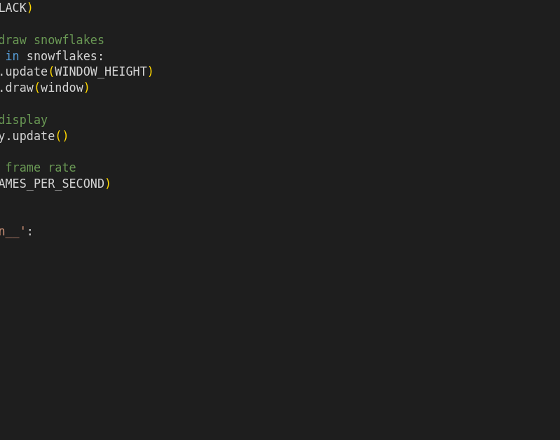

# Snow Animation

## Description

The Snow Animation is a Python program that uses the Pygame library to create a simulation of falling snowflakes. This program generates snowflakes falling gently on the screen.

### Files

- `snow.py`: Contains the `Snowflake` class definition, responsible for managing the properties and behavior of the falling snowflakes.
- `main_snow.py`: The main program file for the snow animation.

## How It Works

The program employs the Pygame library to create a graphical window for rendering and animating the falling snowflakes. Here's how it works:

- **Initialization**: The `Snowflake` class is responsible for managing the snowflake's properties and behavior. In the constructor, it initializes parameters such as the window dimensions, initial position, falling speed, size, and color. 

- **Animation Loop**: The `main_snow.py` program contains an animation loop that handles Pygame event processing, snowflake updates, drawing, and rendering. The loop repeats continuously, creating the illusion of falling snowflakes.

- **Snowflake Movement**: The `Snowflake` class's `move` method updates the snowflake's position by incrementing its y-coordinate. When a snowflake reaches the bottom of the window, it wraps around to the top, and a new random x-coordinate is generated.

- **Drawing Snowflakes**: The `draw` method in the `Snowflake` class uses Pygame to render the snowflake as a simple white circle at its current position on the window.

- **Display**: Pygame continually updates the window display, providing an aesthetically pleasing snowfall animation.

## Program Input & Output

Execute `main_snow.py` to start the snow animation. The animation will run until the user closes the Pygame window.

The output is a graphical display of falling snowflakes. Users will see snowflakes gently falling from the top to the bottom of the window.

#### Snow Animation Output

  

