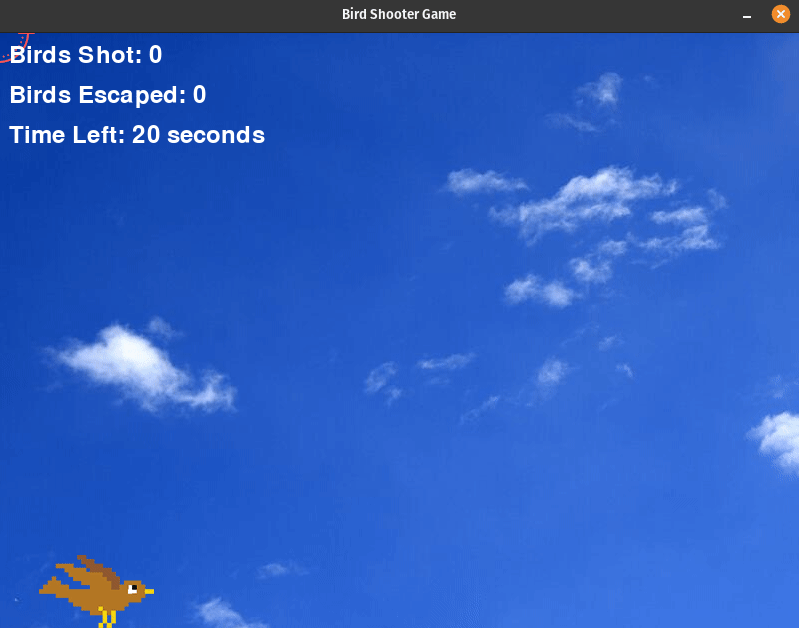

# Bird Shooter Game

## Description

The Bird Shooter Game is a simple shooting game built using Pygame. The objective of the game is to shoot birds as they fly across the screen using a targeting cursor. Each successful shot earns a point, while missed shots count as losses.

### Features

- Random bird appearances with different speeds.
- Animated bird flapping.
- Precise aiming and shooting mechanics.
- Score tracking for shot and escaped birds.
- A timer to limit the game duration.

## How it Works

The game combines player interaction, timed challenges, and animated bird targets. Here's how it works:

- The `bird.py` module contains the implementation of a bird animation class. This class provides functionality for animating and rendering birds on the screen.

- **Initialization**: The program initializes a Pygame window, creates various bird objects, and sets up initial values such as the window size, bird properties, and game variables like hits and escapes.

- **Game Loop**: The core of the game is a loop that runs continuously, responsible for updating and rendering the game elements. Within this loop:
   - Birds are created at random positions on the screen.
   - The player can aim and shoot by clicking with the left mouse button.
   - The game timer counts down from the starting time.
   - The program keeps track of hits and misses.

- **Aiming and Shooting**: Players aim at the birds using the mouse cursor and click to shoot. Successful hits are recorded, and the birds are removed.

- **Countdown Timer**: The game features a countdown timer. The timer starts at the beginning of the game and counts down as players shoot birds.

- **Hit and Miss Counter**: Successful shots are recorded and displayed on the screen. Players can also see the number of escaped birds. Maintaining accuracy is key to achieving a high hit rate.

- **End of Game**: When the timer reaches zero, the game concludes. The final score, including hits and escaped birds, is displayed on the screen. 

### How to Play

- Birds appear randomly on the screen.
- **Aim and Shoot**: Use your mouse (sniper cursor) to aim at the birds on the screen and left-click to shoot.
- **Timer**: Keep an eye on the timer. The game ends when the timer runs out.
- **Accuracy**: Try to shoot as many birds as possible while maintaining accuracy.
- After 20 seconds, the game displays the score and ends.

## Game Output

- When you run the game, it will display a window containing the bird shooter game.
- Birds will appear randomly on the screen.
- The goal is to shoot as many birds as possible within a 20-second time limit by left-clicking on them.
- When you successfully hit a bird, it will be removed from the screen, and your score will increase.
- If a bird escapes off the screen, the escaped bird counter will increment.
- After the 20-second time limit, the game will end.

  

