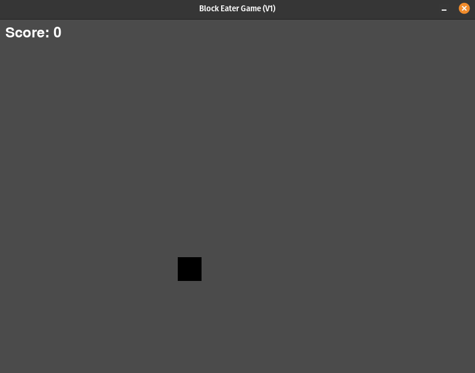

# Block Eater Game (Version 1)

## Description

The Block Eater Game (Version 1) is a Python program developed using the Pygame library. This version features a simple gameplay mechanic where players control a block that moves across the screen, aiming to consume food blocks that spawn at random intervals. The game includes smooth controls for directional movement, food spawning, and consumption.

### Files

- `player.py`: Contains the Player class definition, managing the player-controlled block's properties and behavior.
- `food.py`: Contains the Food class definition, handling the properties and behavior of the spawning food blocks.
- `main.py`: The main program file for Block Eater Game (Version 1).

### Features

- Player-controlled block with smooth directional movement.
- Food blocks spawning at random intervals.
- Collision detection for the player and food blocks.
- Continuous gameplay with the ability to consume multiple food blocks.

## How It Works

The game revolves around the interaction between the player-controlled block and the spawning food blocks. Here's how it works:

- **Initialization**: The program initializes a Pygame window, creates a player object, and sets up initial values such as the window size, player properties, and game variables.
   - **Player Initialization**: The Player class initializes a player-controlled block with specified properties such as window dimensions, initial position, size, and speed.
   - **Food Initialization**: The Food class handles the spawning of food blocks with random positions within the window boundaries.

- **Game Loop**: The core of the game is a continuous loop in `main.py`. Key aspects include:
   - Player movement in four directions (up, down, left, right) based on user input.
   - Food blocks spawning at random intervals.
   - Continuous checks for collisions between the player block and food blocks.

- **Player Movement**: Players can control the block's movement using arrow keys (up, down, left, right) or wsad keys. The block moves smoothly in the specified direction.

- **Food Spawning**: Food blocks spawn at random positions on the screen at intervals.

- **Collision Detection**: The program continuously checks for collisions between the player block and the food blocks. When a collision occurs, the player consumes the food block.

- **Continuous Gameplay**: The game provides a continuous gaming experience, allowing players to consume multiple food blocks and enjoy prolonged gameplay.

### How to Play

1. **Directional Movement**: Use the arrow keys or wsad (up / w, down / s, left / a, right / d) to move the player block in the desired direction.
2. **Consuming Food**: Move the player block to collide with the spawned food blocks to consume them.
3. **Scoring**: The game has a simple scoring system, eating a food item increments your score by 1. Players can aim to consume as many food blocks as possible.

### Game Output

- When you run the game, it will display a window containing the block eater game.
- The player-controlled block will be present on the screen, and you can move it using the arrow keys or wsad keys.
- Food blocks will spawn at random intervals.
- The goal is to move the player block to consume the spawned food blocks.
- Continuous gameplay allows for prolonged engagement.

