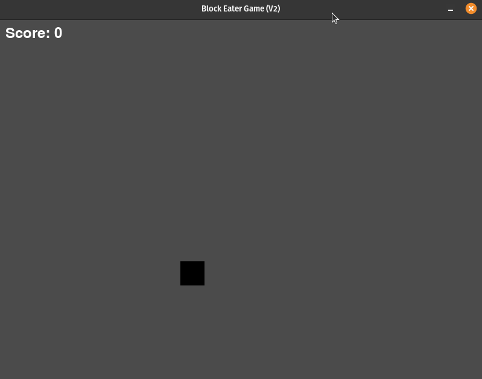

# Block Eater Game (Version 2)

## Description

The Block Eater Game (Version 2) extends the original game with additional features. This version introduces different types of food, each with its own rarity and score. Players control a block that aims to consume food blocks spawning at random intervals. The program features smooth controls, varied food types, and an enhanced scoring system.

### Files

- `player.py`: Contains the Player class definition, managing the player-controlled block's properties and behavior.
- `food.py`: Contains the Food class definition, handling the properties and behavior of the spawning food blocks.
- `main.py`: The main program file for Block Eater Game (Version 2).

### Features

- Player-controlled block with smooth directional movement.
- Food blocks spawning at random intervals.
- Three types of food of varying rarity and scores.
- Collision detection for the player and food blocks.
- Continuous gameplay with the ability to consume multiple food blocks.

## How It Works

This version builds upon the mechanics of Version 1, introducing different types of food with varying rarity and scores. Key aspects include:

- **Food Types**: The Food class now includes three types of food: default green (common), blue (rare), and red (very rare).

- **Scoring System**: Each food type has its own score - green (1 point), blue (2 points), and red (5 points).

- **Varied Rarity**: The rarity of each food type is not equally distributed. Blue and red food are rarer than the default green food.

- **Continuous Gameplay**: The game maintains continuous gameplay, allowing players to consume various food types.

### How to Play

1. **Directional Movement**: Use the arrow keys or WASD (up / w, down / s, left / a, right / d) to move the player block in the desired direction.
2. **Consuming Food**: Move the player block to collide with the spawned food blocks to consume them.
3. **Scoring**: Different food types have varied scores - green (1 point), blue (2 points), and red (5 points). Aim for a higher score.

### Game Output

- When you run the game, it will display a window containing the block eater game.
- The player-controlled block will be present on the screen, and you can move it using the arrow keys or WASD keys.
- Food blocks will spawn at random intervals.
- The goal is to move the player block to consume the spawned food blocks. Consume various food types to achieve a higher score.
- Continuous gameplay allows for prolonged engagement.

