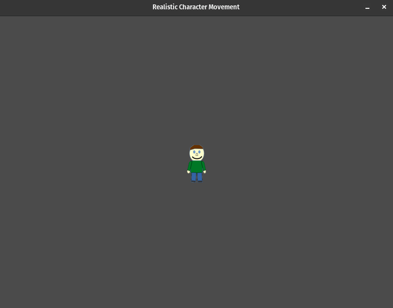

# Character Movement

## Description

"Character Movement" contains two Pygame programs that showcase character animation and movement. The first program demonstrates how to move a character on the screen using a sequence of different images, creating the illusion of movement. The second program illustrates how to simulate realistic character movement with a sprite sheet to achieve smooth animation. You can view and download the sprite sheet here: [https://itch.io/](https://sagak-art-pururu.itch.io/24pxminicharacters)

#### Programs

- [Character Movement with Multiple Images](move_character_1.py): This program displays character movement by switching between various character images to create the illusion of walking.
- [Realistic Character Movement with Sprite Sheet](move_character_2.py): This program simulates realistic character movement using a sprite sheet to create smooth animation.

## How it Works

Each program here focuses on character animation and movement using different techniques. They share a similar basic structure:

- **Importing the Pygame Framework:**
    - Import `pygame` module and its objects to access various elements.
    - Use `from pygame.locals import *` to import constants for convenient use in the script.
    - Import `sys` to handle script termination using `sys.exit()`.

- **Initialize Pygame:**
    - Initialize Pygame using `pygame.init()`, which prepares the modules for use, including hardware setup.

- **Create a window with specific properties:**
    - Use `pygame.display.set_mode()` to create a display surface (window) with specified dimensions (e.g., 800x600 pixels).
    - This function returns a Surface object representing the display, and it can accept flags and depth parameters for display creation.

- **Load Assets:**
    - Both programs handle asset loading by specifying the paths to character images or sprite sheets.
    - In "Character Movement with Multiple Images," images are loaded individually, while in "Realistic Character Movement with Sprite Sheet," a sprite sheet is loaded and divided into individual frames.

- **Initialize Variables:**
    - Initialize variables to control character animation and movement, such as character position, animation step counts, and directions.

- **Enter the main loop:**
    - The main loop runs indefinitely, managing the window's content and refreshing once per screen cycle.

Within the main game loop:

- **Handle Events:**
    - Manage events such as mouse clicks, key presses, and window close requests.
    - Listen for the QUIT event to detect the user clicking the window's close button.
    - Perform necessary cleanup by calling `pygame.quit()` and `sys.exit()` when the program should exit.

- **Handle Game/Program Logic:**
    - The "Character Movement with Multiple Images" program (`move_character_1.py`) switches between different character images to create the illusion of walking.
    - The "Realistic Character Movement with Sprite Sheet" program (`move_character_2.py`) uses a sprite sheet (which contains multiple frames of the character's animation.) to simulate smooth and realistic character movement.

- **Update the Display:**
    - Clear the display surface to erase any prior content before drawing new content on the screen.
    - Update the display to showcase the character animation and movement.

- **Control the Frame Rate:**
    - The frame rate is set to 30 frames per second to regulate updates and achieve smooth rendering.

## Program Input & Output

Both programs focus on character animation and movement, producing character motion and interaction on the Pygame window. The primary output is the dynamic character animation and movement displayed within the program window. The user can control character movement through keyboard input.

#### Character Movement with Multiple Images (move_character_1.py) Output:

  

#### Character Movement with Sprite Sheet (move_character_2.py) Output

  

