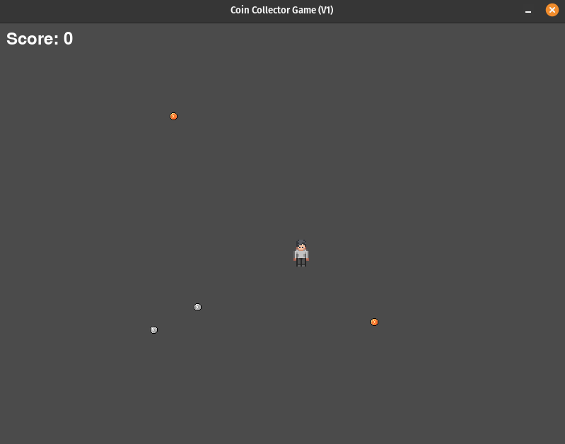

# Coin Collector Game (Version 1)

## Description

The Coin Collector Game (Version 1) is a Python program developed using the Pygame library. This game features a player-controlled sprite that moves across the screen, collecting coins of varying rarity and value. The game includes smooth controls, random spawning of coins, collision detection, and a scoring system based on the rarity of collected coins.

### Credits

- **Player Sprite**: The character sprite used in the game is sourced from [24px Mini Characters](https://sagak-art-pururu.itch.io/24pxminicharacters) by Sagak Art.
- **Coin Images**: The coin images used in the game are sourced from [Coins Pixel Art - Silver, Gold, Crystal, and more](https://opengameart.org/content/coins-pixel-art-silver-gold-crystal-and-more) by Loel on OpenGameArt.

### Files

- `player.py`: Contains the Player class definition, managing the player-controlled sprite's properties and behavior.
- `coin.py`: Contains the Coin class definition, handling the properties and behavior of spawning coins with varying rarity and scores.
- `main.py`: The main program file for the Coin Collector Game (Version 1).

### Features

- Player-controlled sprite with smooth directional movement.
- Coins spawning with varying rarity and scores at random intervals.
- Collision detection for the player and coins.
- Scoring system based on the rarity of collected coins.
- Continuous gameplay with the ability to collect multiple coins.

## How It Works

The game revolves around the interaction between the player-controlled sprite and the spawning coins. Here's how it works:

- **Initialization**: The program initializes a Pygame window, creates a player object, and sets up initial values such as the window size, player properties, and game variables.
   - **Player Initialization**: The Player class initializes a player-controlled sprite with specified properties such as window dimensions, initial position, size, and speed.
   - **Coin Initialization**: The Coin class handles the spawning of coins with varying rarity and scores at random positions within the window boundaries.

- **Game Loop**: The core of the game is a continuous loop in `main.py`. Key aspects include:
   - Player movement in four directions (up, down, left, right) based on user input.
   - Coins spawning at random intervals with varying rarity.
   - Continuous checks for collisions between the player sprite and coins.
   - Scoring based on the rarity of collected coins.

- **Player Movement**: Players can control the sprite's movement using arrow keys (up, down, left, right) or WASD keys. The sprite moves smoothly in the specified direction.

- **Coin Spawning**: Coins spawn at random positions on the screen at intervals. Each coin has its own rarity, determining its appearance frequency.

- **Collision Detection**: The program continuously checks for collisions between the player sprite and the spawning coins. When a collision occurs, the player collects the coin, and the score is updated based on the coin's rarity.

- **Scoring System**: The game features a scoring system where each collected coin contributes to the player's score based on its rarity.

- **Continuous Gameplay**: The game provides a continuous gaming experience, allowing players to collect multiple coins and enjoy prolonged gameplay.

### How to Play

1. **Directional Movement**: Use the arrow keys or WASD (up / w, down / s, left / a, right / d) to move the player sprite in the desired direction.
2. **Collecting Coins**: Move the player sprite to collide with the spawned coins to collect them.
3. **Scoring**: The game has a scoring system based on the rarity of collected coins. Rarer coins yield higher scores.
4. **Continuous Gameplay**: Enjoy continuous gameplay as coins spawn at random intervals, providing opportunities to increase your score.

### Game Output

- When you run the game, it will display a window containing the Coin Collector Game.
- The player-controlled sprite will be present on the screen, and you can move it using the arrow keys or WASD keys.
- Coins of varying rarity will spawn at random intervals.
- The goal is to move the player sprite to collect the spawned coins and increase your score.
- Continuous gameplay allows for prolonged engagement.

**Note**: For demonstration purposes, coin spawn rate has been increased.

