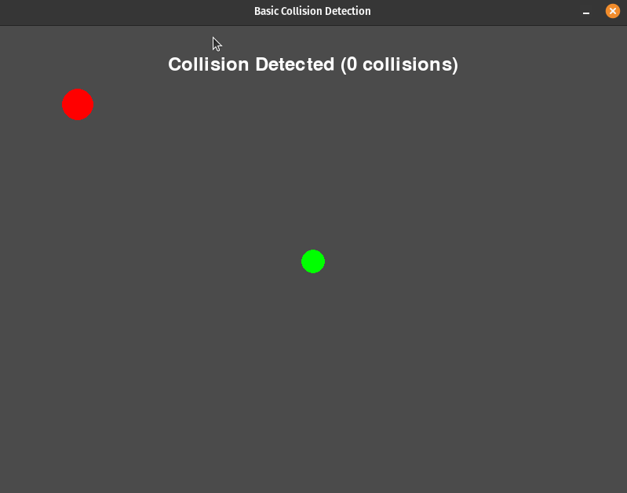
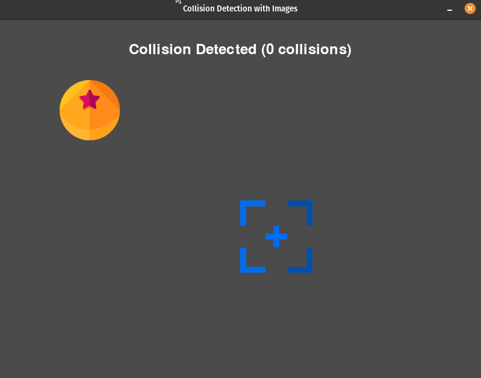

# Collision Detection

## Description

"Collision Detection" contains programs that demonstrate basic collision detection in the Pygame window.

#### Programs

- [Collision Detection](collision_detection_1.py): This program shows how to detect collisions between two circles.
- [Collision Detection with images](collision_detection_1.py): This program shows how to detect collisions between images of a ball and a target.

## How it Works

The programs in "Collision Detection" showcase basic collision detection examples using Pygame. These programs follow a common structure:

- **Importing the Pygame Framework:**
    - Import `pygame` module and its objects to access various elements.
    - Use `from pygame.locals import *` to import constants for convenient use in the script.
    - Import `sys` to handle script termination using `sys.exit()`.

- **Initialize Pygame:**
    - Initialize Pygame using `pygame.init()`, which prepares the modules for use, including hardware setup.

- **Create a window with specific properties:**
    - Use `pygame.display.set_mode()` to create a display surface (window) with specified dimensions (e.g., 800x600 pixels).
    - This function returns a Surface object representing the display, and it can accept flags and depth parameters for display creation.

- **Load Assets:**
    - To display images on the screen, load them using `pygame.image.load()` function which accepts the path to the image you want to load.

- **Initialize Variables:**
    - Initialize variables for the positions and Rects of the player/ball and target:
        - `player_x` and `player_y` set the initial position of the player/ball circle.
        - `target_x` and `target_y` set the initial position of the target circle/image.
        - player_radius and target_radius define the radii of the circles.
        - `collision_count` is a variable to track number of collisions within the loop

- **Enter the main loop:**
    - The main loop runs indefinitely, managing the window's content and refreshing once per screen cycle.

Within the main game loop:

- **Handle Events:**
    - Manage events such as mouse clicks, key presses, and window close requests.
    - Listen for the QUIT event to detect the user clicking the window's close button.
    - Perform necessary cleanup by calling `pygame.quit()` and `sys.exit()` when the program should exit.

- **Handle Game/Program Logic:**
    - Handle continuous key presses events to move the player circle or the ball.
    - For the Simple Collision Detection (collision_detection_1.py):
        - Calculate the distance between the centers of two circles using the Pythagorean theorem ($\text{distance} = \sqrt{(x^2 - x^1)^2 + (y^2 - y^1)^2}$).
        - If the calculated distance is less than the sum of the radii of the two circles (`PLAYER_RADIUS` + `TARGET_RADIUS`), a collision is detected.
    - For the Collision Detection with Images (collision_detection_2.py):
        - Use the `colliderect` method of Pygame to check if the bounding rectangles of two images (ball and target) intersect.
        - If the rectangles intersect, a collision is detected.
        - Update the ball Rect position for collision detection.

- **Update the Display:**
    - Clear the display surface to erase any prior content before drawing new content on the screen.
    - Draw the player and target circles on the window.

- **Control the Frame Rate:**
    - The frame rate is set to 30 frames per second to regulate updates and achieve smooth rendering.

## Program Input & Output

The primary output is the graphical window showing item that moves and a target. When a collision occurs, a message that counts the number of collisions will be displayed.

#### `collision_detection_1.py` Output:

#### `collision_detection_2.py` Output:

