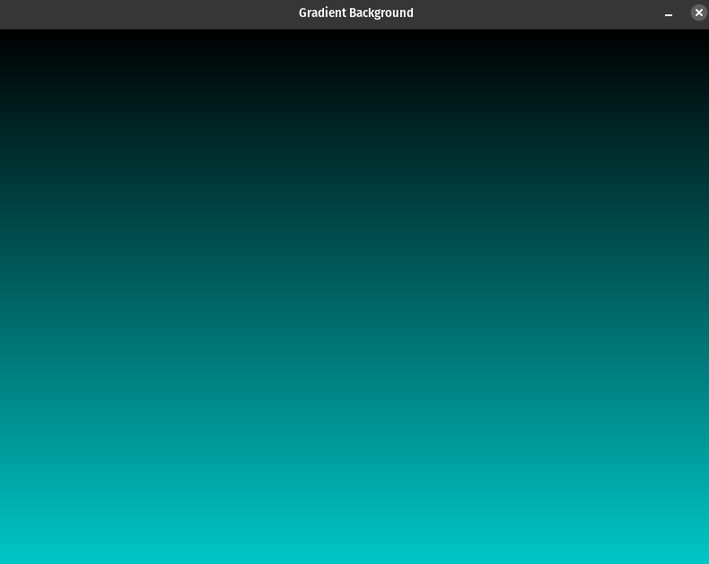
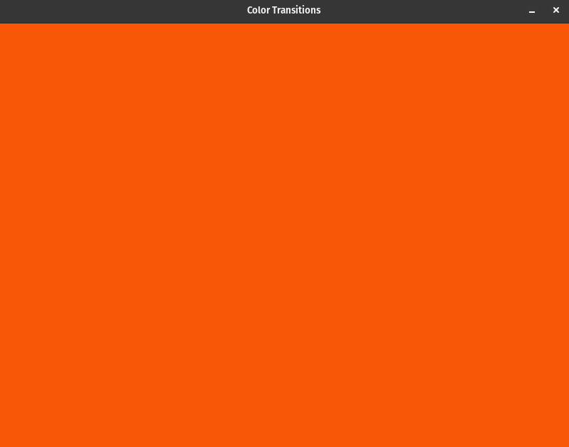
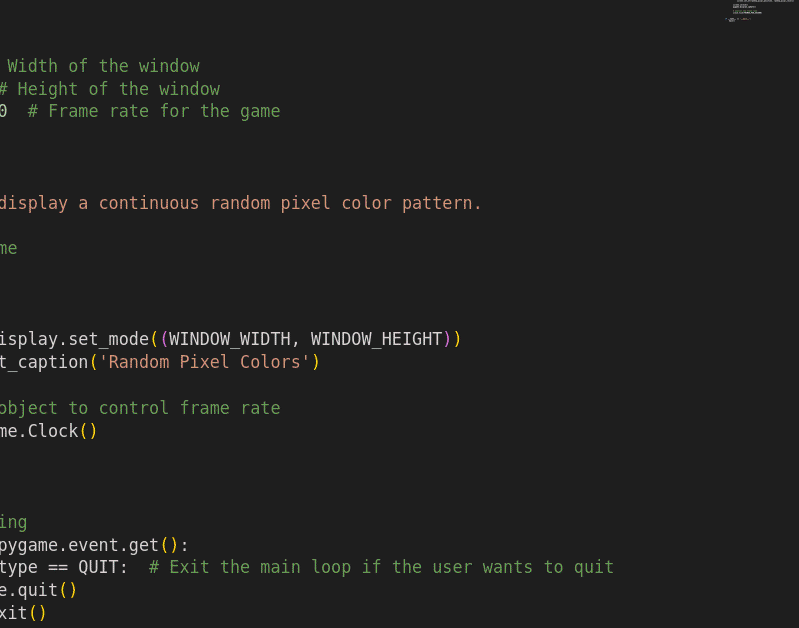

# Color and Styling

## Description

"Color and Styling" contains programs that demonstrate how to work with colors and styles to create visually appealing elements in Pygame.

#### Programs
- [Color Transitions](color_transitions.py): This program shows how to create smooth color transitions over time by using mathematical functions to calculate RGB values.
- [Gradient Background](gradient_background.py): This program demonstrates how to create a gradient background by adjusting the color based on the vertical position.
- [Random Pixel Colors](pixel_colors.py): This program continuously generates random pixel colors on the screen.

## How it Works

Each program here showcases different aspects of working with colors and styling in Pygame. They follow the same basic structure:

- **Importing the Pygame Framework:**
    - Import `pygame` module and its objects to access various elements.
    - Use `from pygame.locals import *` to import constants for convenient use in the script.
    - Import `sys` to handle script termination using `sys.exit()`.

- **Initialize Pygame:**
    - Initialize Pygame using `pygame.init()`, which prepares the modules for use, including hardware setup.

- **Create a window with specific properties:**
    - Use `pygame.display.set_mode()` to create a display surface (window) with specified dimensions (e.g., 800x600 pixels).

- **Enter the main loop:**
    - The main loop runs indefinitely, managing the window's content and refreshing once per screen cycle.

Within the main game loop:

- **Handle Events:**
    - Manage events such as mouse clicks, key presses, and window close requests.
    - Listen for the QUIT event to detect the user clicking the window's close button.
    - Perform necessary cleanup by calling `pygame.quit()` and `sys.exit()` when the program should exit.

- **Handle Game/Program Logic:**
    - In the "Color Transitions" program, this section calculates colors based on time to create smooth transitions.
    - In the "Gradient Background" program, this section creates a gradient by adjusting color based on the vertical position.
    - In the "Random Pixel Colors" program, it continuously generates random pixel colors.

- **Update the Display:**
    - Clear the display surface before drawing new content on the screen.
    - Update the display to show the desired styling or color effect.
    - Redraw the screen using `pygame.display.update()` to reduce flickering and ensure that the in-memory image is displayed to the user.

- **Control the Frame Rate:**
    - The frame rate is set to 30 frames per second to regulate updates and achieve smooth rendering.

## Program Input & Output

The primary output is the Pygame window customized based on each program's styling or color effect.

#### Gradient Background (gradient_background.py) Output:

The program creates a visually appealing gradient background by adjusting the color based on the vertical position.

  

#### Color Transitions (color_transitions.py) Output

This program creates smooth color transitions over time by adjusting the background color.

  

#### Random Pixel Colors (random_pixel_colors.py) Output

This program continuously generates random pixel colors on the screen.

  

