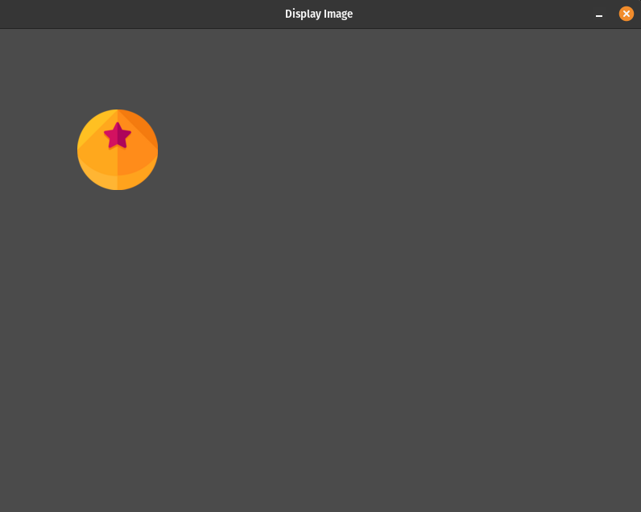
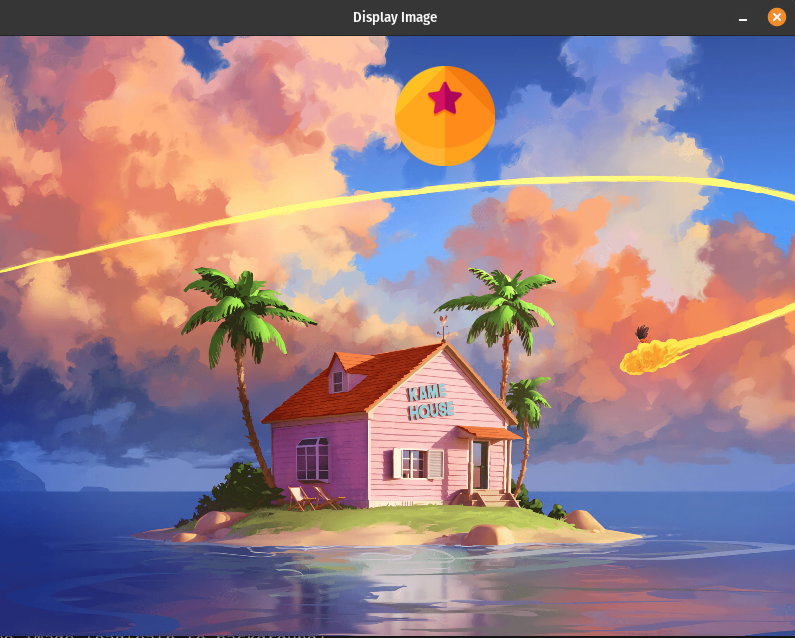

# Handling Images

## Description

"Handling Images" contains programs that demonstrate how to display images in the Pygame window.

#### Programs

- [Display Image](display_image_1.py): This program displays a single image on the screen.
- [Display Image and Background](display_image_2.py): This program displays both an image and a background image on the screen.

## How it Works

Each program in the "Handling Images" focuses on loading and displaying images using Pygame. The programs share a common structure:

- **Importing the Pygame Framework:**
    - Import `pygame` module and its objects to access various elements.
    - Use `from pygame.locals import *` to import constants for convenient use in the script.
    - Import `sys` to handle script termination using `sys.exit()`.

- **Initialize Pygame:**
    - Initialize Pygame using `pygame.init()`, which prepares the modules for use, including hardware setup.

- **Create a window with specific properties:**
    - Use `pygame.display.set_mode()` to create a display surface (window) with specified dimensions (e.g., 800x600 pixels).
    - This function returns a Surface object representing the display, and it can accept flags and depth parameters for display creation.

- **Load Assets:**
    - To display images on the screen, load them using `pygame.image.load()` function which accepts the path to the image you want to load. 

- **Enter the main loop:**
    - The main loop runs indefinitely, managing the window's content and refreshing once per screen cycle.

Within the main game loop:

- **Handle Events:**
    - Manage events such as mouse clicks, key presses, and window close requests.
    - Listen for the QUIT event to detect the user clicking the window's close button.
    - Perform necessary cleanup by calling `pygame.quit()` and `sys.exit()` when the program should exit.

- **Handle Game/Program Logic:**
    - Handle game logic or display-related logic in this section.

- **Update the Display:**
    - Clear the display surface to erase any prior content before drawing new content on the screen.
    - Redraw the screen using `pygame.display.update()` to reduce flickering and ensure that the in-memory image is displayed to the user.

- **Control the Frame Rate:**
    - The frame rate is set to 30 frames per second to regulate updates and achieve smooth rendering.

## Program Input & Output

The primary output consists of the graphical window with the displayed image(s) and, in the case of "Display Image and Background," a background image as well.

#### Single image display (`display_image.py`) Output:

#### Image + Background image display (`display_image_2.py`) Output:

