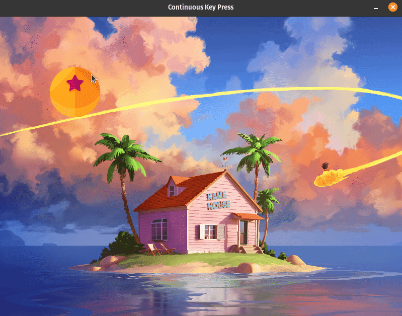

# Input Handling

## Description

"Input Handling" contains programs that demonstrate how to handle user input, such as keyboard and mouse events, in Pygame.

#### Programs

- [On Click Key Presses](on_click_key_press.py): This program allows you to move an image by clicking arrow keys.
- [Continuous Key Press](continuous_key_press.py): This program enables you to continuously move an image by holding down arrow keys.

## How it Works

The programs in "Input Handling" showcase how to interact with user input using Pygame. These programs follow a common structure:

- **Importing the Pygame Framework:**
    - Import `pygame` module and its objects to access various elements.
    - Use `from pygame.locals import *` to import constants for convenient use in the script.
    - Import `sys` to handle script termination using `sys.exit()`.

- **Initialize Pygame:**
    - Initialize Pygame using `pygame.init()`, which prepares the modules for use, including hardware setup.

- **Create a window with specific properties:**
    - Use `pygame.display.set_mode()` to create a display surface (window) with specified dimensions (e.g., 800x600 pixels).
    - This function returns a Surface object representing the display, and it can accept flags and depth parameters for display creation.

- **Load Assets:**
    - To display images on the screen, load them using `pygame.image.load()` function which accepts the path to the image you want to load. 

- **Initialize Variables:**
    - Initialize key variables used in the program:
        - `image_x` sets the initial X-coordinate of the image.
        - `image_y` sets the initial Y-coordinate of the image.

- **Enter the main loop:**
    - The main loop runs indefinitely, managing the window's content and refreshing once per screen cycle.

Within the main game loop:

- **Handle Events:**
    - Manage events such as mouse clicks, key presses, and window close requests.
    - Listen for the QUIT event to detect the user clicking the window's close button.
    - Perform necessary cleanup by calling `pygame.quit()` and `sys.exit()` when the program should exit.

- **Handle Game/Program Logic:**
    - In the case of "On Click Key Presses," you can move the image by pressing arrow keys once, changing the image's position in response to these key presses.
        - When you press the left arrow key (`K_LEFT`), the `image_x` variable decreases, causing the image to move to the left.
        - When you press the right arrow key (`K_RIGHT`), the `image_x` variable increases, causing the image to move to the right.
        - When you press the up arrow key (`K_UP`), the `image_y` variable decreases, causing the image to move up.
        - When you press the down arrow key (`K_DOWN`), the `image_y` variable increases, causing the image to move down.

    - In "Continuous Key Press," you can continuously move the image by holding down arrow keys, adjusting the image's position based on the keys held.
        - When you hold down the left arrow key (`K_LEFT`), the `image_x` variable continuously decreases, causing the image to move continuously to the left.
        - When you hold down the right arrow key (`K_RIGHT`), the `image_x` variable continuously increases, causing the image to move continuously to the right.
        - When you hold down the up arrow key (`K_UP`), the `image_y` variable continuously decreases, causing the image to move continuously upwards.
        - When you hold down the down arrow key (`K_DOWN`), the `image_y` variable continuously increases, causing the image to move continuously downwards.

- **Update the Display:**
    - Clear the display surface to erase any prior content before drawing new content on the screen.
    - Redraw the screen using `pygame.display.update()` to reduce flickering and ensure that the in-memory image is displayed to the user.

- **Control the Frame Rate:**
    - The frame rate is set to 30 frames per second to regulate updates and achieve smooth rendering.

## Program Input & Output

The primary output consists of the graphical window with interactive input handling features for each program.

#### On Click Key Presses (`on_click_key_press.py`) Output:

Each key press results in an immediate change in the image's position.

  

#### Continuous Key Press (`continuous_key_press.py`) Output:

The image's position updates as long as the arrow keys are held, creating a fluid and continuous movement effect.

  

