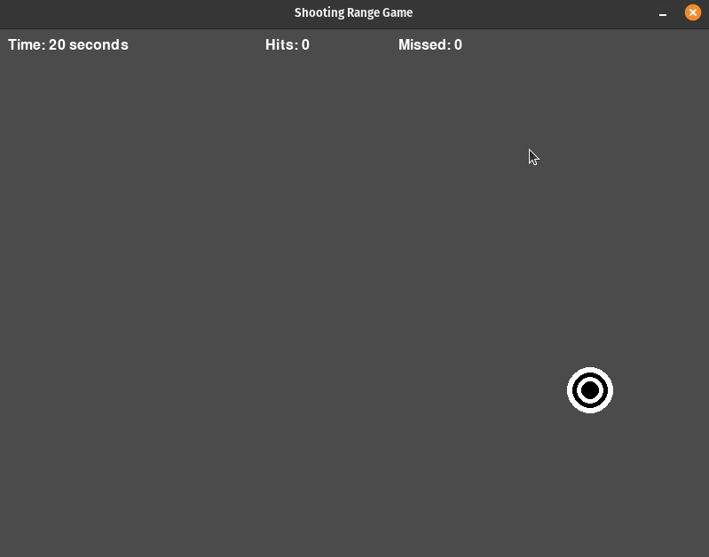

# Shooting Range Game

## Description

The Shooting Range Game is a Python program developed using the Pygame library that offers an engaging and challenging shooting experience. In this game, players aim to shoot a variety of targets that appear on the screen. The program provides a countdown timer, records the number of successful hits, and keeps track of missed targets.

### Features

- Multiple targets with different sizes.
- Dynamic target appearance at random positions.
- Precise aiming and shooting mechanics.
- Countdown timer.
- Hit target and missed target counter.

## How It Works

The game combines player interaction, timed challenges, and graphical targets. Here's how it works:

- **Initialization**: The program initializes a Pygame window, creates various target objects, and sets up initial values such as the window size, target properties, and game variables like hits and misses.

- **Game Loop**: The core of the game is a loop that runs continuously, responsible for updating and rendering the game elements. Within this loop:
   - Targets are created at random positions on the screen.
   - The player can aim and shoot by clicking with the left mouse button.
   - The game timer counts down from the starting time.
   - The program keeps track of hits and misses.

- **Aiming and Shooting**: Players aim at the targets using the mouse cursor and click to shoot. Successful hits are recorded, and the targets disappear.

- **Countdown Timer**: The game features a countdown timer. The timer starts at the beginning of the game and counts down as players shoot targets.

- **Hit and Miss Counter**: Hits (successful shots) are recorded and displayed on the screen. Players can also see the number of missed targets. It's essential to maintain accuracy to achieve a high hit rate.

- **End of Game**: When the timer reaches zero, the game concludes. The final score, including hits and misses, is displayed on the screen. 

### How to Play

1. **Aim and Shoot**: Use your mouse to aim at the targets on the screen and left-click to shoot.
2. **Timer**: Keep an eye on the timer. The game ends when the timer runs out.
3. **Accuracy**: Try to shoot as many targets as possible while maintaining accuracy.

### Game Output

- When you run the game, it will display a window containing the target shooter game.
- Targets will appear randomly on the screen one by one at different intervals.
- The goal is to shoot as many targets as possible within a 20-second time limit by left-clicking on them.
- When you successfully hit a target, it will disappear from the screen, and your score will increase.
- If you miss a target, the missed targets counter will increment.
- After the 20-second time limit, the game will end, and your final score will be displayed on the screen.
- You will have the option to play the game again or quit the program.

  

