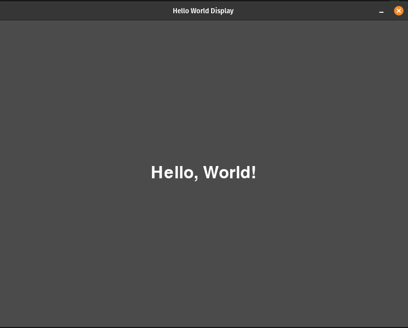
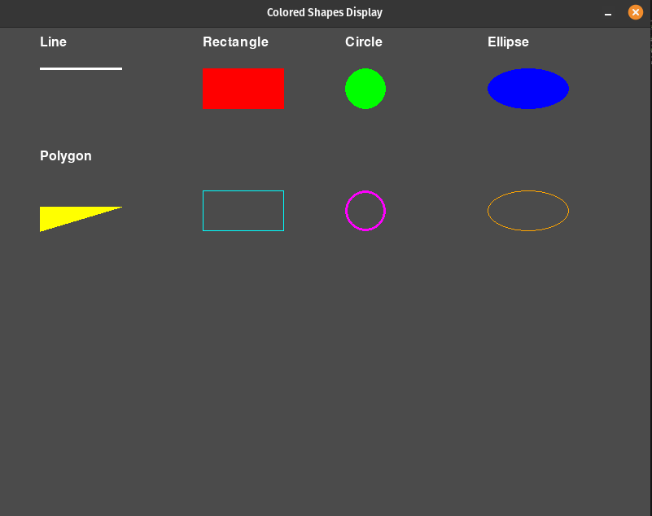
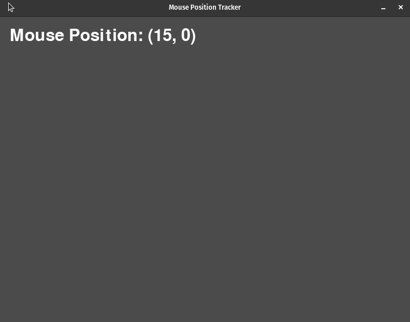

# Text and Display

## Description

"Text and Display" contains programs that demonstrate text rendering and display-related functionalities in Pygame. 

#### Programs

- [Hello World Text](hello_world_text.py): This program displays the text "Hello, World!" in the middle of the screen.
- [Mouse Position Tracker](display_mouse_position.py): This program tracks and displays the current mouse position on the screen.
- [Shapes Display](display_shapes.py): This program showcases the drawing of various shapes, including lines, rectangles, circles, ellipses, and polygons, with color customization and labels.

## How it Works
Each program in this category showcases different aspects of text rendering, mouse tracking, and shape drawing in Pygame. Here's how these programs work:

- **Importing the Pygame Framework:**
    - Import `pygame` module and its objects to access various elements.
    - Use `from pygame.locals import *` to import constants for convenient use in the script.
    - Import `sys` to handle script termination using `sys.exit()`.

- **Initialize Pygame:**
    - Initialize Pygame using `pygame.init()`, which prepares the modules for use, including hardware setup.

- **Create a window with specific properties:**
    - Use `pygame.display.set_mode()` to create a display surface (window) with specified dimensions (e.g., 800x600 pixels).
    - This function returns a Surface object representing the display, and it can accept flags and depth parameters for display creation.

- **Enter the main loop:**
    - The main loop runs indefinitely, managing the window's content and refreshing once per screen cycle.

Within the main game loop:

- **Handle Events:**
    - Manage events such as mouse clicks, key presses, and window close requests.
    - Listen for the QUIT event to detect the user clicking the window's close button.
    - Perform necessary cleanup by calling `pygame.quit()` and `sys.exit()` when the program should exit.

- **Handle Game/Program Logic:**
    - In text display program, this section displays text using Pygame's font rendering capabilities.
    - In mouse tracking program, it retrieves the current mouse position and displays it on the screen.
    - In the shapes program, this section handles the drawing of various shapes and their labels.

- **Update the Display:**
    - Clear the display surface to erase any prior content before drawing new content on the screen.
    - Redraw the screen using `pygame.display.update()` to reduce flickering and ensure that the in-memory image is displayed to the user.

- **Control the Frame Rate:**
    - The frame rate is set to 30 frames per second to regulate updates and achieve smooth rendering.

## Program Input & Output

These programs showcase different aspects of text rendering, mouse tracking, and shape drawing in Pygame. The output primarily consists of the graphical window itself, which is customized based on each program's requirements.

#### Hello World Text (`hello_world_text.py`) Output:

#### Shapes Display (`display_shapes.py`) Output:

#### Mouse Position Tracker (`display_mouse_position.py`) Output:

