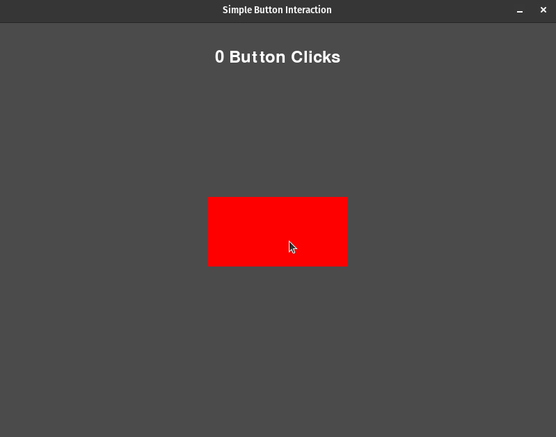
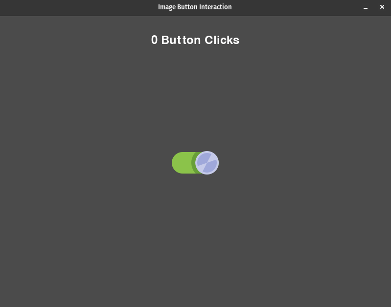

# User Interaction

## Description

"User Interaction" programs showcase how to handle user input, such as button clicks and interactions, in Pygame.

#### Programs

- [Simple Button Interaction](simple_btn_interaction.py): This program demonstrates the interaction with a simple button.
- [Image Button Interaction](image_btn_interaction.py): This program showcases interaction with an image button that changes appearance when clicked.

## How it Works

The programs in "User Interaction" demonstrate different aspects of user interaction using Pygame. These programs follow a common structure:

- **Importing the Pygame Framework:**
    - Import `pygame` module and its objects to access various elements.
    - Use `from pygame.locals import *` to import constants for convenient use in the script.
    - Import `sys` to handle script termination using `sys.exit()`.

- **Initialize Pygame:**
    - Initialize Pygame using `pygame.init()`, which prepares the modules for use, including hardware setup.

- **Create a window with specific properties:**
    - Use `pygame.display.set_mode()` to create a display surface (window) with specified dimensions (e.g., 800x600 pixels).
    - This function returns a Surface object representing the display, and it can accept flags and depth parameters for display creation.

- **Load Assets:**
    - To display images on the screen, load them using `pygame.image.load()` function which accepts the path to the image you want to load.
    - In the "Image Button Interaction" program, load image assets for button states, i.e. the button in the up state and the down state.

- **Initialize Variables:**
    - In both programs, initialize key variables used in the program:
        - In the "Simple Button Interaction" program, create a rectangle representing the button and a counter to track button clicks.
        - In the "Image Button Interaction" program, initialize variables for button states and tracking button clicks.

- **Enter the main loop:**
    - The main loop runs indefinitely, managing the window's content and refreshing once per screen cycle.

Within the main game loop:

- **Handle Events:**
    - Manage events such as mouse clicks, key presses, and window close requests.
    - Listen for the QUIT event to detect the user clicking the window's close button.
    - Perform necessary cleanup by calling `pygame.quit()` and `sys.exit()` when the program should exit.
    - Detect and handle button clicks based on user interactions with the button element.

- **Handle Game/Program Logic:**
    - In the "Simple Button Interaction" program, handle button clicks to increase a click counter, demonstrating user interaction.
    - In the "Image Button Interaction" program, display different button images based on button clicks, creating a visual response to user interactions.

- **Update the Display:**
    - Clear the display surface to erase any prior content before drawing new content on the screen.
    - In both programs, draw button elements and additional visual content, such as text or images, to provide a user interface for interaction.

- **Control the Frame Rate:**
    - The frame rate is set to 30 frames per second to regulate updates and achieve smooth rendering.

## Program Input & Output

The primary output in these programs is the graphical window with interactive elements. User interaction, such as button clicks or image state changes, demonstrates how to handle and respond to user input.

#### Simple Button Interaction (simple_btn_interaction.py) Output:

  

#### Image Button Interaction (image_btn_interaction.py) Output:

  

