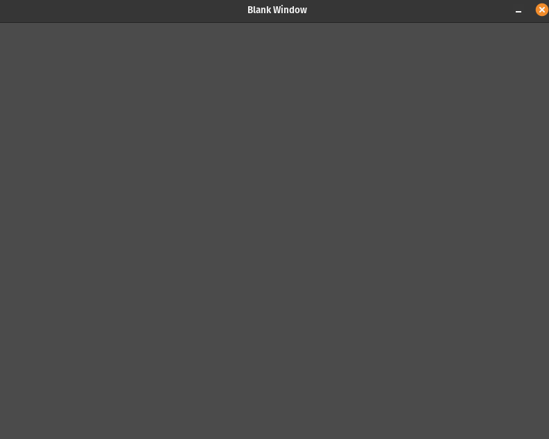
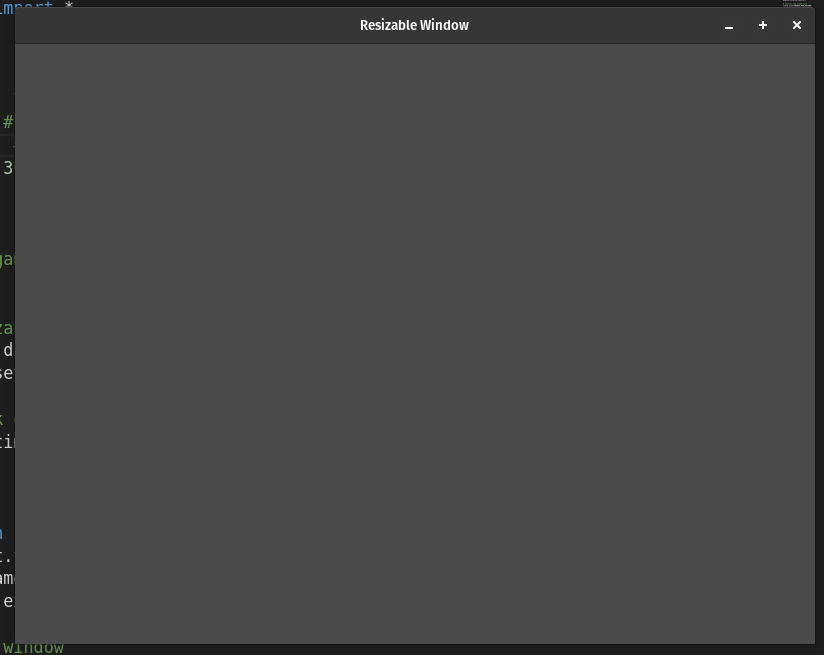

# Window Basics

## Description

"Window Basics" contains programs that demonstrate fundamental window-related functionalities using the Pygame library.

#### Programs

- [Blank Window](blank_window.py): This program creates a blank Pygame window.
- [Fullscreen Window](fullscreen_window.py): This program creates a Pygame window in fullscreen mode.
- [Resizable Window](resizable_window.py): This program creates a resizable Pygame window.

## How it Works

Each program here showcases a specific aspect of window creation in Pygame. These programs follow the same basic structure:

- **Importing the Pygame Framework:**
    - Import `pygame` module and its objects to access various elements.
    - Use `from pygame.locals import *` to import constants for convenient use in the script.
    - Import `sys` to handle script termination using `sys.exit()`.

- **Initialize Pygame:**
    - Initialize Pygame using `pygame.init()`, which prepares the modules for use, including hardware setup.

- **Create a window with specific properties:**
    - Use `pygame.display.set_mode()` to create a display surface (window) with specified dimensions (e.g., I use 800x600 pixels in the demonstrations here).
    - This function returns a Surface object representing the display, and it can accept flags and depth parameters for display creation.
        - In the `fullscreen_window.py` program, use the `FULLSCREEN` flag for the second parameter of `set_mode`. That is, `window = pygame.display.set_mode((WINDOW_WIDTH, WINDOW_HEIGHT), pygame.FULLSCREEN)`. This creates a display that fills the entire screen. Note that when you go full screen, your video card will probably switch to a different video mode, which will change the width and height of the display and potentially how many colors it can show at one time.
        - In the `resizable_window.py` program, use the `RESIZABLE` flag for the second parameter of `set_mode`. That is, `window = pygame.display.set_mode((WINDOW_WIDTH, WINDOW_HEIGHT), pygame.RESIZABLE)`. This creates a resizable display.

- **Enter the main loop:**
    - The main loop is structured to run indefinitely, managing the window's content, typically refreshing once per screen cycle.

Within the main game loop:

- **Handle Events:**
    - Manage events such as mouse clicks, key presses, and window close requests.
    - Listen for the QUIT event to detect the user clicking the window's close button.
    - Perform necessary cleanup by calling `pygame.quit()` and `sys.exit()` when the program should exit.

- **Handle Game/Program Logic:**
    - As the program evolves, this section will contain code to handle keyboard and mouse interactions.

- **Update the Display:**
    - Before drawing new content on the screen, clear the display surface to erase any prior content.
    - Use `pygame.display.update()` to redraw the screen, reducing flickering and ensuring that the in-memory image is displayed to the user.

- **Control the Frame Rate:**
    - Set the frame rate to 30 frames per second to regulate updates and achieve smooth rendering.

## Program Input & Output

These programs are primarily about window creation, so the output is the graphical window itself, customized based on the particular program's requirements.

The `fullscreen_window.py` program will display will create a display that fills the entire screen.

#### blank_window.py output

  

#### resizable_window.py

  

